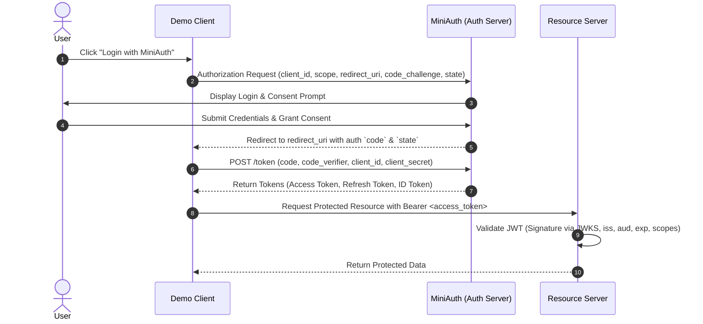

# MiniAuth

> **OAuth 2.0 & OpenID Connect (OIDC) Platform Built from Scratch**

MiniAuth is a learning-focused authentication and authorization platform built from the ground up to deeply understand how OAuth 2.0 and OpenID Connect work internally under the hood.

> [!NOTE]
> The goal is not to build a drop-in replacement for production enterprise identity providers like Okta or Auth0, but to master modern identity and access management protocols by implementing all major specifications end-to-end.

---

## 📐 System Architecture

```
                         ┌─────────────────────────┐
                         │       Demo Client       │
                         │   (Frontend + Backend)  │
                         └────────────┬────────────┘
                                      │
                               OAuth 2.0 / OIDC
                                      │
                                      ▼
                        ┌───────────────────────────┐
                        │         MiniAuth          │
                        │    Authorization Server   │
                        ├───────────────────────────┤
                        │ • Authentication          │
                        │ • Authorization / RBAC    │
                        │ • OAuth 2.0 Engine        │
                        │ • OpenID Connect (OIDC)   │
                        │ • Token & JWKS Service    │
                        │ • User Consent            │
                        │ • Client Management       │
                        └─────────────┬─────────────┘
                                      │
                        ┌─────────────┼─────────────┐
                        ▼             ▼             ▼
                 ┌────────────┐ ┌───────────┐ ┌───────────┐
                 │ PostgreSQL │ │   Redis   │ │ Key Store │
                 └─────┬──────┘ └─────┬─────┘ └───────────┘
                       │              │
             ┌─────────┴────────┐     └──────────┬──────────┐
             │ • Users & Roles  │                │ • Sessions       │
             │ • Clients        │                │ • Auth Codes     │
             │ • User Consents  │                │ • Token Metadata │
             └──────────────────┘                └──────────────────┘

                                      │
                                 Access Token
                                      │
                                      ▼
                        ┌───────────────────────────┐
                        │      Resource Server      │
                        │      (Protected API)      │
                        ├───────────────────────────┤
                        │ • JWT Signature Verify    │
                        │ • Issuer / Audience Check │
                        │ • Scope Enforcement       │
                        │ • Role-Based Access Ctrl  │
                        └───────────────────────────┘
```

---

## 🔄 Core OAuth 2.0 + PKCE & OIDC Flow



---

## 🧩 MiniAuth Components

### 1. Authentication
- User registration and login
- Secure password hashing (Argon2id / bcrypt)
- Cookie-based authentication sessions
- Secure logout and session invalidation

### 2. OAuth 2.0 Core
- Dynamic/Static client registration
- `/authorize` endpoint (Authorization Code Grant with **PKCE**)
- `/token` endpoint (Access & Refresh token issuance)
- Redirect URI validation and state verification
- Granular scope negotiation and validation

### 3. OpenID Connect (OIDC)
- Cryptographically signed **ID Tokens** (JWT)
- `/userinfo` endpoint with standard claims (`sub`, `name`, `email`, etc.)
- OIDC Discovery (`/.well-known/openid-configuration`)
- Standard scopes (`openid`, `profile`, `email`)

### 4. Authorization & RBAC
```
User ──► Role ──► Permission
```
- User-to-Role and Role-to-Permission mapping
- Client-to-Scope mapping
- User consent recording and enforcement
- Resource Server scope-based and permission-based authorization

### 5. Token & Cryptographic Infrastructure
- Asymmetric signing keys (RSA / ECDSA)
- **JWKS Endpoint** (`/.well-known/jwks.json`)
- Key rotation support with `kid` (Key ID) headers
- Token expiration, revocation, and refresh-token rotation
- Industry-standard cryptographic primitives

---

## 🗄️ Data Storage Design

| Store | Purpose | Data Entities |
| :--- | :--- | :--- |
| **PostgreSQL** | Persistent Relational Data | `users`, `roles`, `permissions`, `user_roles`, `role_permissions`, `oauth_clients`, `client_scopes`, `consents` |
| **Redis** | Ephemeral & High-Speed Cache | User sessions, single-use authorization codes, PKCE challenges, temporary OAuth state, refresh-token metadata |
| **Key Store** | Cryptographic Material | Active & retired private/public key pairs for JWT signing |

---

## 🛡️ Resource Server (Protected API)

A standalone service demonstrating how downstream APIs consume and validate tokens issued by MiniAuth without tight coupling.

### Responsibilities
- Extract and inspect `Bearer` tokens from the `Authorization` header
- Validate JWT signature using MiniAuth's public keys via **JWKS**
- Validate standard claims: `iss` (issuer), `aud` (audience), and `exp` (expiration)
- Enforce required scopes for protected endpoints
- Return appropriate HTTP status codes (`401 Unauthorized` vs `403 Forbidden`)

```http
GET /api/files HTTP/1.1
Host: api.example.com
Authorization: Bearer <access_token>
```

---

## 🛠️ Technology Stack

| Layer | Technology |
| :--- | :--- |
| **Backend** | Go (Golang) |
| **Database** | PostgreSQL |
| **Cache / Session Store** | Redis |
| **Frontend** | React |
| **Containerization** | Docker & Docker Compose |
| **CI / CD** | GitHub Actions |
| **Protocols & Standards** | OAuth 2.0 (RFC 6749, RFC 7636 PKCE), OIDC Core 1.0, JWT (RFC 7519), JWKS (RFC 7517) |

---

## 🗺️ Implementation Roadmap

### Phase 1 — Foundation
- [ ] Go project structure & layout
- [ ] HTTP server & middleware routing
- [ ] PostgreSQL integration & migrations
- [ ] Redis client integration
- [ ] Structured configuration & logging
- [ ] Docker Compose environment (App + Postgres + Redis)

### Phase 2 — User Authentication
- [ ] User registration endpoint
- [ ] Secure password hashing
- [ ] Login endpoint & session management
- [ ] Logout & session invalidation

### Phase 3 — OAuth 2.0 Core
- [ ] OAuth client registration & storage
- [ ] `/authorize` endpoint implementation
- [ ] Authorization code generation & short-lived Redis storage
- [ ] Redirect URI strict matching & validation
- [ ] `/token` endpoint & authorization code exchange
- [ ] Access token generation

### Phase 4 — PKCE (Proof Key for Code Exchange)
- [ ] Support `code_challenge` & `code_challenge_method` (`S256`)
- [ ] Validate `code_verifier` during token exchange
- [ ] Bind PKCE challenges to authorization codes

### Phase 5 — Token Lifecycle Management
- [ ] Signed JWT access tokens
- [ ] Refresh token issuance & rotation
- [ ] Token expiration policies
- [ ] Token revocation endpoint (`/revoke`)

### Phase 6 — OpenID Connect (OIDC)
- [ ] OIDC Discovery endpoint (`/.well-known/openid-configuration`)
- [ ] ID Token issuance with standard OIDC claims
- [ ] `/userinfo` endpoint supporting `openid`, `profile`, and `email` scopes

### Phase 7 — Granular Authorization & Consent
- [ ] Role-Based Access Control (RBAC) schema & middleware
- [ ] User consent screen & approval storage
- [ ] Scope authorization and consent enforcement

### Phase 8 — Resource Server
- [ ] Standalone Protected API service
- [ ] JWKS client with in-memory caching
- [ ] JWT validation middleware
- [ ] Scope & permission enforcement (`401` vs `403`)

### Phase 9 — Key Management & Cryptography
- [ ] RSA / ECDSA key generation
- [ ] Public JWKS endpoint (`/.well-known/jwks.json`)
- [ ] Key rotation support with `kid` tracking
- [ ] Grace period support for multiple active keys

### Phase 10 — Production-Grade Hardening
- [ ] Rate limiting & brute-force protection
- [ ] Security headers & CORS policies
- [ ] Structured audit logging & distributed tracing
- [ ] Graceful shutdown & health check probes

---

## 🎯 Learning Goals & System Design Takeaways

By completing this project, the following core concepts will be thoroughly mastered and demonstrable:

```
MiniAuth Mastery
├── OAuth 2.0 (Auth Code, PKCE, Access/Refresh Tokens, Scopes, Client Auth)
├── OpenID Connect (ID Tokens, UserInfo Claims, OIDC Discovery)
├── Security & Cryptography (JWT, JWKS, Key Rotation, Token Lifecycle)
├── Authorization Models (RBAC, Scopes, Consents, Resource Server Validation)
└── Distributed Systems (Stateless Services, Redis Caching, PostgreSQL, Horizontal Scaling)
```

> **End Goal:** A publicly deployable, full-stack demonstration where a user can click **"Login with MiniAuth"**, authenticate, grant consent, receive OAuth 2.0 / OIDC tokens, and consume protected resources securely.